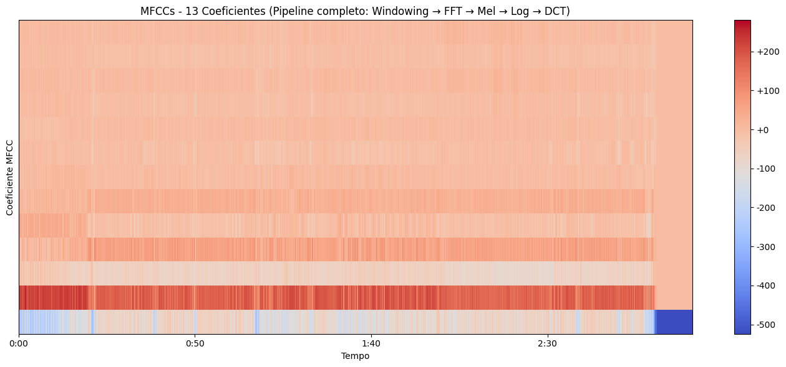

# Análise Exploratória de Áudio com Librosa 🔊

Extraí os 13 coeficientes MFCC clássicos – o pipeline completo (windowing → FFT → Mel filterbank → log → DCT) está implementado.

- Matriz resultante: 13 coeficientes × número de frames temporais
- Visualização do heatmap dos MFCCs está no notebook (próximo passo: salvar como imagem)

## Redução de Dimensionalidade Incrível
- Áudio bruto → milhões de amostras de amplitude
- Após processamento → **apenas 13 números** que resumem a "alma" do som (timbre essencial)

**Coeficientes MFCC médios calculados neste áudio**:
MFCC 1:  -123.83
MFCC 2:  +168.10
MFCC 3:   -58.69
MFCC 4:   +50.19
MFCC 5:    -2.98
MFCC 6:   +26.44
MFCC 7:    +1.37
MFCC 8:    -6.63
MFCC 9:    +0.92
MFCC 10:   -4.81
MFCC 11:   +3.66
MFCC 12:   -5.84
MFCC 13:   +1.80

Análise preliminar: perfil muito próximo de **música pop/rock** – alta energia em frequências médias-altas e distribuição harmônica rica.

## Como Executar
Abra o notebook diretamente no Google Colab e faça upload do seu próprio áudio:

)

## Tecnologias Utilizadas
- Python
- Librosa
- Matplotlib
- Google Colab

#Python #AudioProcessing #Librosa #DataScience #MachineLearning #SignalProcessing
